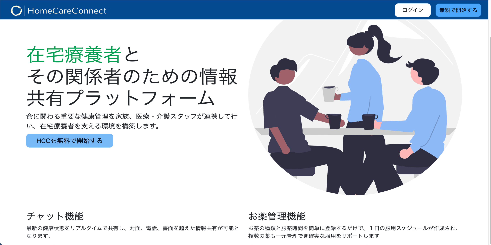

# HomeCareConnect

## ■ サービス URL

~~[HomeCareConnect（サービストップページ）](https://yonex0821naoki.net/)~~ （2023/11/16　公開停止しました）

~~以下の通りテストユーザーとしてログインできますので、ご自由にお使いください。~~

| ログイン ID        | パスワード     | ユーザータイプ |
| ----------------- | ------------ | ------------ |
| tester1 | password | 患者 |
| tester2 | password | 家族 |
| tester3 | password | 看護師 |
| tester4 | password | 医師 |
| tester5 | password | ケアマネジャー |

## ■ サービス概要

在宅療養者にとって、命に関わる重要な健康管理を家族、医療・介護スタッフが連携して行い、在宅療養者を支える環境を構築します。

## ■ サービスを作った想い

現在、私の祖父が高齢になり在宅療養を続ける中で、家族、医療・介護スタッフをはじめとした周りのサポートが必要不可欠になっています。

しかし、患者に関する主な情報の共有方法としては電話や書面がメインであり、関係者が最新の情報を把握し続けることが難しく、迅速かつ適切な対応ができない場合があります。

また、在宅療養では複数の薬を常用していることがほとんどであり、中には飲み忘れにより病状が悪化し、時には命を失う危険性がある薬も含まれます。

こうした課題に対して、「私に何かできることはないか」と考えた結果、今回のサービスを作ることでより支援しやすい環境・体制を整え、祖父が安心して住み慣れた自宅で、最後まで暮らせるように周りが協力して見守っていきたいという想いがあります。

## ■ 課題に対しての実現方法

- 情報共有の難しさ
  - チャット機能を活用し、訪問看護師から医師、ケアマネジャー、そして家族まで、関係者全員が患者の健康状態をリアルタイムで共有します。これにより、情報の整合性を保ちつつ、迅速なサポートを可能にします。

- 確実なお薬の服用
  - 複数の服用しているお薬を登録することで、１日のスケジュールが時間順に表示されるお薬管理機能を実装することで、飲み忘れを防止し、正確な服用をサポートします。

## ■ サービス利用画面

## ■ 機能一覧

| トップ画面 |　新規登録画面 |
| ---- | ---- |
|  |  |
| サービス内容が一目で分かるように実装しました。 | 患者ごとのプラットフォームを作るため患者IDを用意し、認証機能を実装しました。 |

| ログイン画面 |　チャット画面 |
| ---- | ---- |
|  |  |
| ログインIDとパスワードでログインができます。 | ページ更新が不必要なリアルタイムでのチャット機能を実装しました。 |

| お薬追加画面 |　お薬リスト画面 |
| ---- | ---- |
|  |  |
| お薬を追加し、忘れないようにスケジュール化しましょう。 | お薬を一覧で確認できるようにボード表示しました。 |

| お薬編集画面 |　リスト展開画面 |
| ---- | ---- |
|  |  |
| お薬リストの右上の鉛筆マークを選択することで、お薬の内容を編集できます。 | お薬リストのメモを展開できるように実装し、一定のスペースでより多くのお薬が表示されるようにしました。 |

| 服用スケジュール画面 |　ユーザーメニュー画面 |
| ---- | ---- |
|  |  |
| 各種登録されたお薬の内容より1日の服用スケジュールを表示し、スケジュールごとにチェックできるよう実装しました。 | ユーザーに関連する操作をまとめるためユーザーメニューとして実装しました。 |

| ユーザー情報画面 |　ユーザー情報変更画面 |
| ---- | ---- |
|  |  |
| ユーザー情報をモーダルウィンドウで確認できるように実装しました。 | ユーザー情報変更を実装しました。 |

## ■ 使用技術

| カテゴリー         | 使用技術                                     |
| ----------------- | --------------------------------------------------    |
| フロントエンド      | HTML/CSS,  JavaScript, jQuery, Bootstrap5              |
| バックエンド        | Ruby 3.2.2, Ruby on Rails 7.0.5                        |
| データベース    　  | MySQL 8.0.33                                           |
| 本番環境           | AWS（VPC, EC2, RDS, ALB, ACM, Route53）, Nginx, Unicorn |
| 開発環境           | Docker, Docker Compose, Git, GitHub                    |
| Rails             |  ActionCable, devise, dotenv-rails                     |
| 設計ツール          |  Miro, draw.io |

## ■ ER図

## ■ インフラ構成図

## ■ 作成時に工夫した点

１. 患者別のプラットフォーム

- 患者IDを導入することで、患者ごとに紐づいたユーザーが作成されるようになり、患者別のケアや情報共有をスムーズに行えるようにしました。

２. リアルタイムのチャット機能

- プロダクト開発において、リアルタイムでの情報共有が不可欠であると考えたため、Railsの主な機能の1つであるActionCableを導入することにしました。
- ActionCableを用いることで、WebSocketを活用したリアルタイム通信が可能となり、ユーザー間の情報共有を瞬時に行うことができるようになりました。

３. 服用スケジュールの実装

- スケジュールの確認では、チェック欄をAjax通信で行うことによりユーザーは全ページの再読読み込みを待たずに操作でき、スムーズに使用できるように工夫しました。

４. シンプルかつ直感的なUI

- このサービスは幅広い年齢層を対象としているため、ユーザービリティを最優先に、シンプルで直感的なUIを採用しました。
- 具体的には、多くのサービスで一般的に見られるヘッダーとサイドメニューを採用し、リンク部分にカーソルを合わせると色が変わるように統一し、デザインしました。

5. レスポンシブ対応

- サービスの使用状況を考えると、日常生活においてスマホからの使用がメインとなるので、レスポンシブデザインに対応しています。
- サイドメニューの代わりに画面下部にタブバーを採用ことで、画面サイズが小さくなっても見やすさを維持しております。

 

## ■ 今後の課題

1. 通知機能の実装

- 現状、チャット機能ではメッセージの送信があっても頻繁に確認しなければ気づかない、また服用スケジュールではお薬を飲み忘れている場合など、通知機能でこれらが解決できると思います。

2. CI/CDの構築

- CI/CDを通じて自動的なテストとデプロイを行うことで、バグの早期発見や作業の効率化が実現でき、サービスの品質を維持・向上させることができるため、導入する必要があると考えています。

3. フロントエンドのフレームワークの使用

- 現在、CSS、JavaScript、およびBootstrapを基本的な技術として使用していますが、Reactのような現代的なJavaScriptフレームワークを使用しておりません。
- 今後の拡張性やユーザーエクスペリエンスの向上の観点から見直しの必要性を感じており、今後導入していきたいと考えております。

