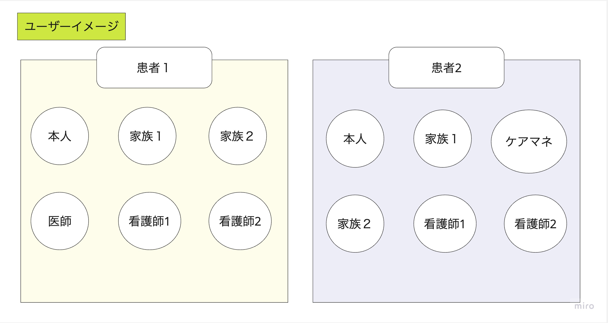

## ER図作成に向けて

<h3>エンティティの抽出</h3>

  - 認証関係
    - ユーザー
    - 患者
  - チャット機能
    - メッセージ
  - お薬管理機能
    - お薬
    - 服用スケジュール

<h3>エンティティ定義</h3>

- Users（ユーザー）
  - ID: 個々のユーザーを識別するための一意の識別子
  - Secret Patient ID: ユーザーがどの患者に紐づいているか識別するための患者ID
  - Password: 認証に使用されるパスワード
  - Name: チャットにおいて表示される名前
  - Email: 通知に使用されるメールアドレス
  - User Type: ユーザーの種類を示す。「患者」「家族」「医師」「看護師」「ケアマネジャー」５種類のタイプ
  - Message Notice: ユーザーがメッセージ通知を受け取るかどうかを制御するフラグ
  - Medication Notice: ユーザーがお薬の通知を受け取るかどうかを制御するフラグ

- Patients（患者リスト）
  - ID: 個々の患者を識別するための一意の識別子。
  - Secret ID: ユーザーエンティティでこれを追加することで、どのユーザーがどの患者に対応しているか追跡可能にする。８文字のランダムな文字列

- Messages（投稿されたメッセージ）
  - ID: 各メッセージを一意に識別する識別子
  - User ID: メッセージを送信したユーザーのID
  - Content: 送信内容
  - Timestamp: 送信時間

- Medications（お薬）
  - ID: 個々のお薬を識別するための一意の識別子
  - Secret Patient ID: このお薬が関連する患者のID
  - Name: お薬の名前
  - Dosage: 服用する量
  - Start Date: 服用開始日時
  - End Date: 服用終了日時
  - Time1: １回目の服用時間
  - Time2: ２回目の服用時間
  - Time3: ３回目の服用時間
  - Time4: ４回目の服用時間
  - Time5: ５回目の服用時間
  - Memo: メモ

- Schedules（服用スケジュール）
  - ID: このスケジュールを識別するための一意の識別子
  - Medication ID: このスケジュールが関連するお薬のID
  - Time: 服用する時間
  - Confirmation: 服用確認、服用したかどうかを示すフラグ
  - Time slot: 何回目の服用か
  - Date: スケジュール日

#### ユーザーのデータイメージ

