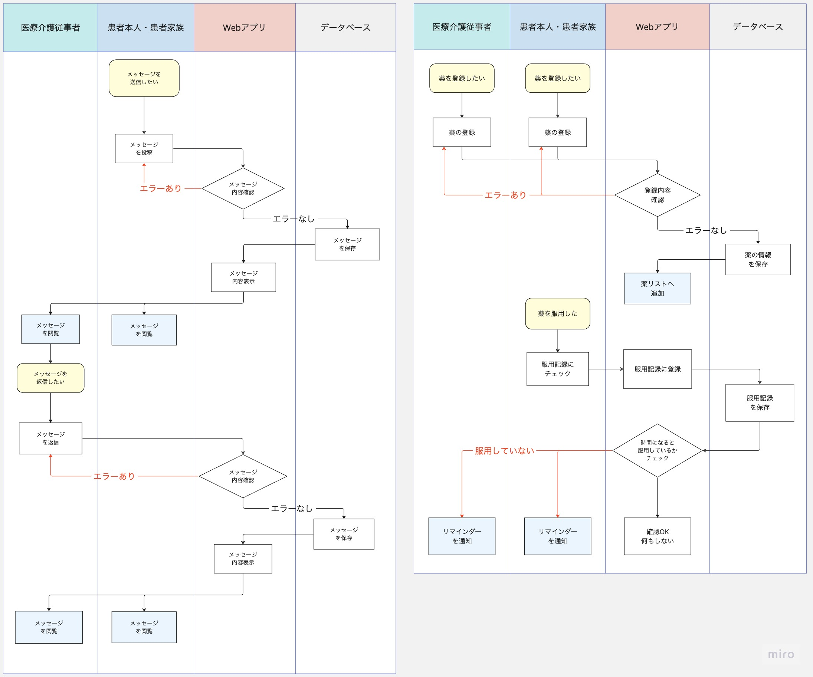
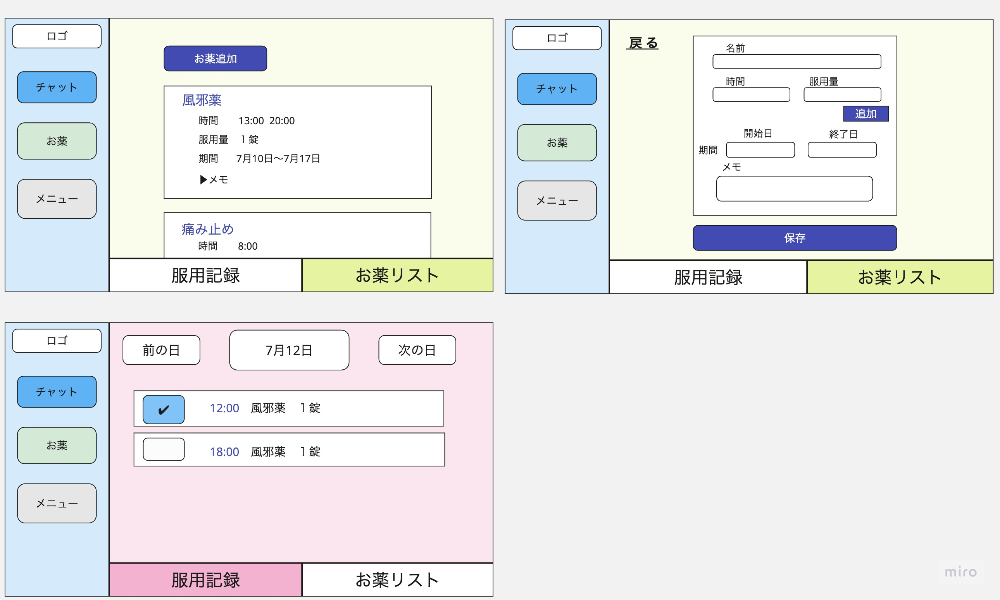

## プロダクト名
HomeCareConnect（在宅療養者における情報共有サービス）

## プロダクト概要
本プロダクトは、在宅療養者とその家族、医療・介護スタッフが情報を円滑に共有するためのプロダクトであり、命に関わる重要な健康管理を全ての関係者が連携して行い、在宅療養者を支える環境を構築することを目的としています。
このプロダクトの特徴は、チャット機能とお薬管理機能の2つです。

チャット機能を用いれば、訪問看護師、医師、ケアマネジャー、家族などが患者の最新の健康状態をリアルタイムでどこでも共有することが可能となります。また、対面、電話、書面だけでなくこのプロダクトを用いることでさらなる情報共有を図ることができます。

お薬管理機能では、服薬時間と種類を記録し、リマインダーを設定することで、薬の服用を確実に行うことができます。さらに、服用確認を記録することで、全ての関係者がその情報を確認できます。

このように患者を支える全ての関係者が繋がりあって、在宅療養を支えるための一助となることを目指しており、新しいアップデートや機能追加を通じて、更に実用的で充実したプロダクトにしていく予定です。

<h3>Who（誰のため？）</h3>
　　

- 祖父（95歳　男性）
  - 1人暮らし
  - 要介護２（家事や食事、排泄といった日常生活動作の一部に見守りや介助が必要な状態）
- 家族
  - 父、母、姉、私
  - 祖父の家まで徒歩10分圏内に在住
  - 毎日、誰か1人が祖父の掃除、洗濯、調理など日常生活のサポートを行う
- ケアマネジャー（40代　女性）
  - 家族から相談に応じ、助言を提供する
  - 介護計画（ケアプラン）の作成及び説明・提案
- 看護師（30〜40代　女性）
  - 担当の看護師3名程が交代で訪問看護
  - 健康状態のチェック
  - 薬の管理
- 医師（50代　男性）
  - 患者の症状について診断
  - 診断結果に基づき、治療の提供・薬の処方

<h3>What（現状の課題は何？）</h3>

- 情報共有の難しさ
  - 家族、医療従事者、介護スタッフなどが関わる中で全員が最新の情報を把握し続けることは困難です。
  - 現状、情報の共有は電話、書面などを通じて行われますが、これらの方法では情報がバラバラになりやすく、全体として整合性を保つことが難しいです。
- 薬の管理
  - 複数の薬を指定された時間に正確に服用するのは困難です。
  - 特に高齢者や認知症の患者は、自分で管理することが難しく、適切な服用を行うためにはサポートが必要です。
- 非常時の対応
  - 突発的な健康問題や事故が発生した際に、迅速に関係者に情報を伝達し、対応することが求められます。
  - しかし、すぐに連絡を取れる体制が整っていない場合、事後の対応が遅れることがあります。
- 負担の偏り
  - 看護や介護は時間と労力を必要とするため、一部の家族やスタッフに負担が偏ることがあります。
  - 負担が偏ると、それがストレスとなり、看護・介護の質に影響を及ぼしたり、持続可能なサポートができなくなります。

<h3>Why（なぜ課題を解決したい？）</h3>

- 情報共有の難しさ
  - すべての関係者が最新かつ一貫した情報を持つことで、在宅療養者の状況把握と対応が迅速かつ適切に行なえるため。
  - 情報共有の精度と速度は、在宅療養者の安全と生活の質に直結するため。
- 薬の管理
  - 正確な薬の服用は治療効果を最大化し、過剰な副作用や薬物間相互作用を防ぐために重要であるため。
  - 特に命に関わる重大な疾患を持つ患者の場合、指示された通りに薬を服用しないと、病状が急速に悪化し、時には命を失う危険性もあるため。
- 非常時の対応
  - 迅速な対応が可能なシステムが整っていると、非常時の際に在宅療養者の安全が確保され、重篤な結果を回避することが可能になるため。
  - 関係者全員が対応情報を共有できれば、連携して迅速な対応が可能となるため。
- 負担の偏り
  - ケア負担の均等化は、介護者のストレス軽減と持続可能なケア提供体制を確保するために重要であるため。

<h3>How（どのようにして実現する？）</h3>

- 情報共有の難しさ
  - チャット機能を備えたプロダクトを導入することで、全ての関係者がリアルタイムで情報を共有できる環境を作ります。
  - 医療・介護スタッフ、家族全員が参加し、状況の報告や重要な連絡事項を投稿できるようにします。
- 薬の管理
  - 服用確認のチェック機能をつけることで、服用されたことを確認できるようにします。
  - 薬の種類、服用時間、量などを登録し、リマインダー機能で服用時間になると通知が届くようにします。
- 非常時の対応
  - 非常時にはまず電話で対応することになると思いますが、電話が繋がらない場合も想定し、チャットを通じて緊急時にも情報を迅速に共有し、適切な対応が可能になるようにします。
- 負担の偏り
  - チャット機能を用いた適切な情報共有と調整によって、ケアタスクを分散し、全員が参加するようなケア体制を作ります。

## 要件定義

<h3>機能要件</h3>

- 認証機能
  - ユーザー登録
    - ユーザーID、パスワード、名前、メールアドレス、ユーザータイプが登録できる。
    - ユーザータイプ「患者」以外を選んだ場合は、「患者ID」を入力しないと新規登録できない
    - 患者本人が始めにユーザー登録し、参加してほしい人には「患者ID」を伝える形式を取る。
  - ログイン
    - ユーザーID、パスワードを入力し、ログインできる。
  - ログアウト
    - メニュー画面より選択し、ログアウトできる。
  - ユーザー情報更新
    - パスワード、メールアドレスのみは変更できる。
  - ユーザーID,パスワード以外でのログイン
    - ユーザーID、パスワードを忘れた場合は、メールアドレスより取得できる。

- チャット機能
  - リアルタイムでメッセージができる。
  - 画像を投稿できるようにする。
  - スタンプやリアクション機能（Advanced）
  - 通知を設定できる。(Advanced)
  - スレッド機能（Advanced）

- お薬管理機能
  - 薬の登録、確認、更新、削除できる。
    - 薬の名前、時間、服用する量、期間、メモ
  - 服用チェック
    - 薬を服用したことを確認できるチェック機能
    - 間違えてチェックしたときのために取り消し機能
  - 服用リマインダー（Advanced）
    - 登録した薬の服用時間から１時間過ぎても服用チェックされていなかったら、通知が送られる。

<h3>非機能要件</h3>

- ユーザビリティ
  - レスポンシブ対応（スマホ、PC、タブレット対応）
  - 高齢者でも直感的に理解でき、分かりやすいシンプルなUIにする。
  - 困ったときに自力で解決できるようにヘルプ機能やFAQを付ける。
  - レスポンス速度は遅くて3秒以内、基本的には1秒以内に行なえるようにする。

- 保守性
  - GitHubへプッシュ時に静的解析で自動チェックする

- 運用性
  - GitHumのmainブランチにマージしたら自動デプロイされるようにする。
  - GithubActionsにてCI/CDの導入

- セキュリティ
  - SSL化（HTTPS化）対応
  - アプリケーションサーバーとデータベースサーバーを分け、データベースサーバーは外部からアクセスできない設計にする。

## 設計

<h3>業務フロー</h3>

  

  
<h4>認証機能</h4>

  

  

  

  
<h4>チャット機能, お薬管理機能</h4>

  

  

<h3>画面遷移図</h3>

<h3>ワイヤーフレーム</h3>

  

  
<h4>ユーザー登録、ログイン機能</h4>

  

  

  

  
<h4>チャット機能</h4>

  

  

  

  
<h4>お薬管理機能</h4>

  

  

  

  
<h4>メニュー機能</h4>

  

  

<h3>ER図</h3>

- [エンティティ定義について詳細](ER_diagram.md)
- [患者テーブルとユーザーテーブルについて(検討中)](reference.md)

<h3>テーブル定義書</h3>

- **Patientsテーブル**

| カラム名 | データ型 | キー | NULL | 初期値 | 備考 |
|:--------|:-------:|:---:|:----:|:-----:|:----:|
| id | INTEGER | Primary | NO | - | AUTO INCREMENT |
| secret_id | String | Unique | NO | - | ランダムな文字列 |

- **Usersテーブル**

| カラム名 | データ型 | キー | NULL | 初期値 | 備考 |
|:--------|:-------:|:---:|:----:|:-----:|:----:|
| id | INTEGER | Primary | NO | - | AUTO INCREMENT |
| secret_patient_id | String | Foreign | NO | -  | ※１|
| password | VARCHAR(255) | - | NO | - | - |
| name | VARCHAR(255) | - | NO | - | - |
| email | VARCHAR(255) | Unique | NO | - | - |
| role | String | - | NO | - | ※２ |
| message_notice | BOOLEAN | - | NO | true | - |
| medication_notice | BOOLEAN | - | NO | true | - |

※１：外部キー制約はPatientsテーブルのsecret_idカラムから設定

※２：ユーザーの種類を示す。「患者」「家族」「医師」「看護師」「ケアマネジャー」より選択する。

- **Messagesテーブル**

| カラム名 | データ型 | キー | NULL | 初期値 | 備考 |
|:--------|:-------:|:---:|:----:|:-----:|:----:|
| id | INTEGER | Primary | NO | - | AUTO INCREMENT |
| user_id | INTEGER | Foreign | NO | -  | - |
| content | TEXT | - | NO | - | - |
| timestamp | DATETIME | - | NO | - | - |

- **Medicationsテーブル**

| カラム名 | データ型 | キー | NULL | 初期値 | 備考 |
|:--------|:-------:|:---:|:----:|:-----:|:----:|
| id | INTEGER | Primary | NO | - | AUTO INCREMENT |
| patient_id | INTEGER | Foreign | NO | -  | - |
| name | VARCHAR(255) | Unique | NO | - | - |
| dosage | VARCHAR(30) | - | NO | - | - |
| start_date | DATE | - | NO | - | - |
| end_date | DATE | - | NO | - | - |
| memo | TEXT | - | YES | - | - |

- **Schedulesテーブル**

| カラム名 | データ型 | キー | NULL | 初期値 | 備考 |
|:--------|:-------:|:---:|:----:|:-----:|:----:|
| id | INTEGER | Primary | NO | - | AUTO INCREMENT |
| medication_id | INTEGER | Foreign | NO | -  | - |
| time | TIME | - | NO | - | - |
| confirmation | BOOLEAN | - | NO | 0 | ※３ |

※３：服用チェックを示す。0は「未チェック」、1は「チェック済み」

### システム構成図

### 使用技術

- バックエンド
  - Ruby 3.2.2
  - Ruby on Rails 7.0.6

- フロントエンド
  - HTML/CSS
  - JavaScript

- データベース
  - MySQL 8.0.33

- 環境構築/インフラ
  - Docker
  - AWS

- その他
  - Rubocop（静的解析ツール）
  - RSpec（テストフレームワーク）
  - GitHub Actions（CI/CD）

<h3>参考内容</h3>

- [フィードバック](feedback.md)

